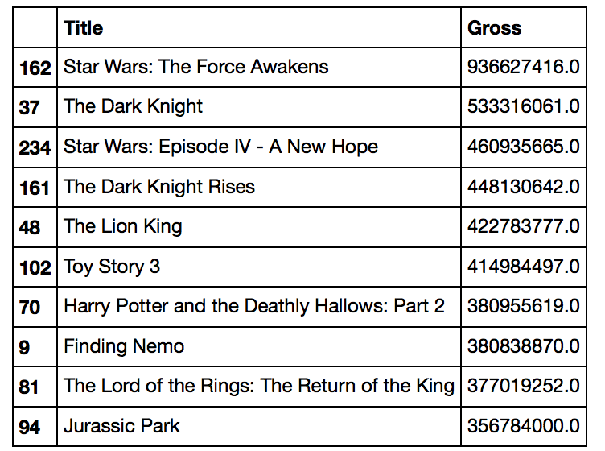

## Overview
These days everywhere entertainment and lots to watch for on the internet ranging from short stories to blogbuster movies. We are going to analyse the popular IMDB movie database and find what make the movie successful in the industry.

Here we are going to only concentrate on top250 movies from IMBD database and analyse what features of the movies makes it successfull. Either its famous Actor, Actress, or Director or Story writer or Awards its won make its success.

## Methods
Using API(Application Programming Interface) its not very technical, just a way to scrape the data from internet and after that I felt like an hacker(don't say to any one - followed the website guidelines to scrape its data)

The respective features we analyse towards the success of the movies are:
* Movie release year
* Genre (Romance, Drama, Comedy etc)
* Awards (Oscar, or its own any other awards)
* Actors

```python
df_movies_g[['Title','Gross']].sort_values('Gross', ascending=False).head(10)
```


Lets look at how many moives release each year and look at its histogram 

```python
df_movies_g['Year'].hist()
plt.title('Histogram of Years')
plt.axvline(np.mean(df_movies['Year']),color="red")
plt.axvline(np.median(df_movies['Year']),color="green")
plt.xlabel('Year')
plt.ylabel('Frequency')
plt.show()
```


